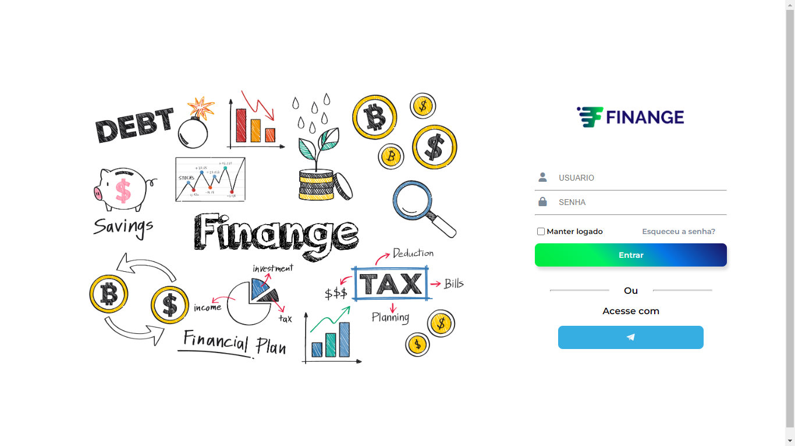
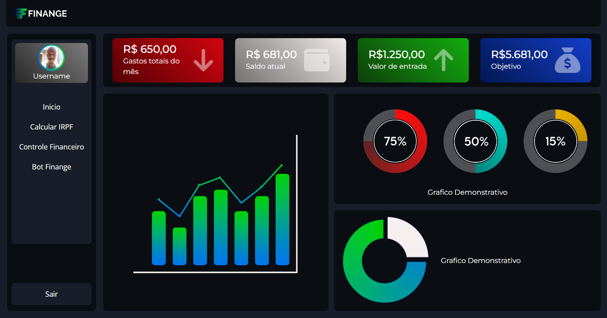

# finange-front

## Iniciando Codigo de front-end

### Cores base da logo  
#### Ref azul : #1B1464
#### Ref verde: #00EA3D

### Cores base do site
#### Ref Azul: #0575E6
#### Ref Verde: #00F260 

Projeto open source para gerenciamento financeiro através de um [bot](https://github.com/Finange/finange-bot) para o telegram com uma 

interface gráfica que funciona simutaniamente em site

> Pagina de login

> Dashboard Desktop

> Dashboard Tablet

> Dashboard Mobile

interface gráfica que funciona simultaneamente em site